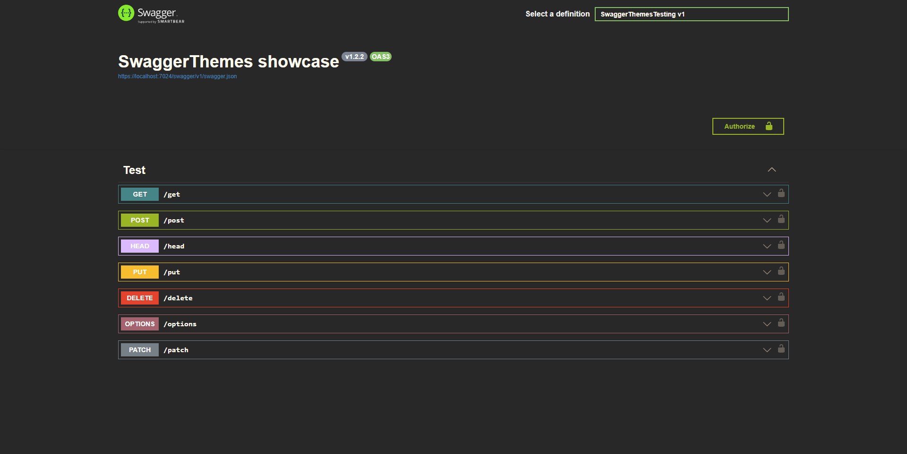
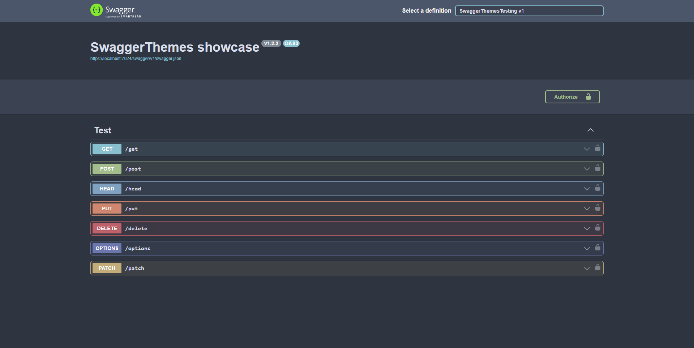

<p align="left">
    
    <h1>Swagger themes</h1>
</p>

[]()
[]()

Change Swagger documentation theme easily.

## Install
With NuGet CLI:
```
nuget install oqo0.SwaggerThemes
```
Using NuGet Package Manager:
https://www.nuget.org/packages/oqo0.SwaggerThemes/

## Usage
Select any theme from [themes list](#themes) and apply it using following ways:
#### Using with Swashbuckle
```csharp
app.UseSwagger();
app.UseSwaggerThemes(Theme.UniversalDark);
app.UseSwaggerUI();
```

> [!IMPORTANT] 
> Don't use `UseSwaggerUI()` before `UseSwaggerThemes()` or themes are not going to get installed.

#### Using with NSwag
```csharp
app.UseOpenApi();
app.UseSwaggerUi(options =>
{
    options.CustomInlineStyles = SwaggerTheme.GetSwaggerThemeCss(Theme.UniversalDarkx);
});
```

#### Adding custom CSS
```csharp
string customCss = "body {" +
                   "    background-color: red;" +
                   "}";

app.UseSwaggerThemes(Theme.UniversalDark, customCss );
```

## Themes
#### Dracula

```csharp
Theme.Dracula
```

#### Gruvbox

```csharp
Theme.Gruvbox
```

#### Monokai

```csharp
Theme.Monokai
```

#### Nord Dark

```csharp
Theme.NordDark
```

#### One Dark

```csharp
Theme.OneDark
```

#### Universal Dark

```csharp
Theme.UniversalDark
```

#### X-Code Light

```csharp
Theme.XCodeLight
```

## Creating your own themes

1. Create theme `.css` in `Themes` directory.
2. Add a placeholder for filename in `Theme.cs`:
```csharp
public static Theme YourTheme => new("your-theme.css");
```
3. Add an embedded resource for your `.css` file:
```xml
    ...
    <EmbeddedResource Include="Themes\your-theme.css" />
</ItemGroup>
```
4. Use any other complete theme as a template.
5. Build project:  
```
dotnet build --configuration Release
```