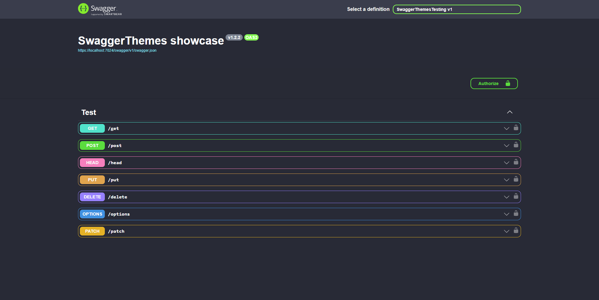
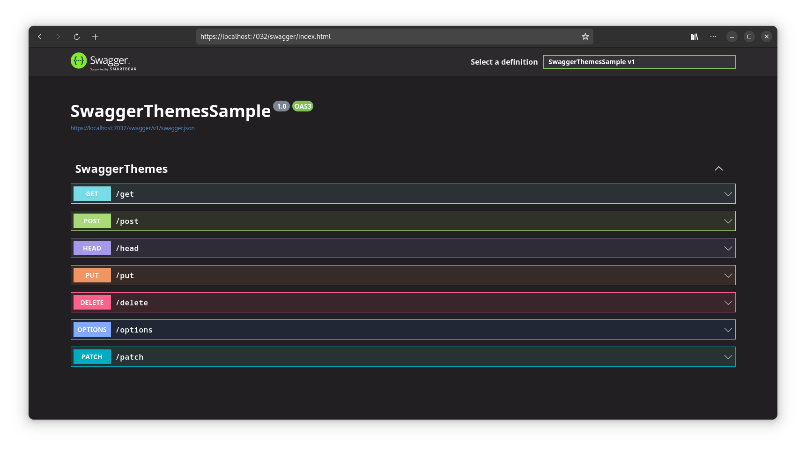
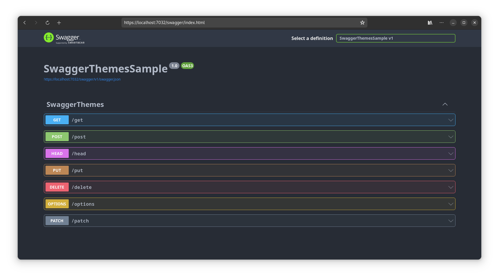
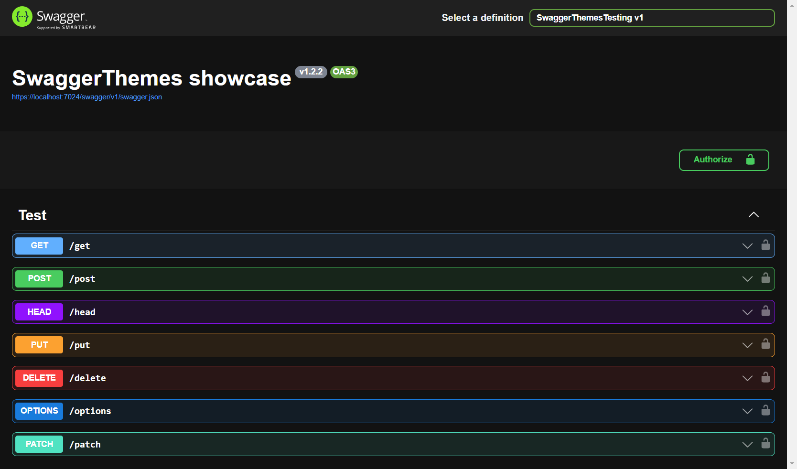
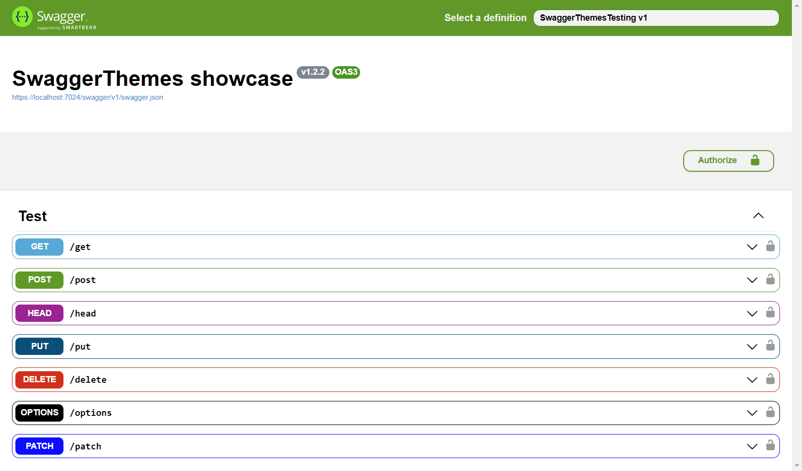

# Swagger themes

[]()
[]()

Change Swagger documentation theme easily.

## Install
With NuGet CLI:
```
nuget install oqo0.SwaggerThemes
```
Using NuGet Package Manager:
https://www.nuget.org/packages/oqo0.SwaggerThemes/

## Usage
```csharp
app.UseSwagger();
app.UseSwaggerThemes(Theme.UniversalDark);
```

> [!WARNING]  
> Don't use `UseSwaggerUI()` before `UseSwaggerThemes()` or themes are not going to get installed.

#### Adding custom CSS
```csharp
string customCss = "body {" +
                   "    background-color: red;" +
                   "}";

app.UseSwaggerThemes(Theme.UniversalDark, customCss );
```

## Themes
#### Dracula

```csharp
app.UseSwaggerThemes(Theme.Dracula);
```

#### Monokai

```csharp
app.UseSwaggerThemes(Theme.Monokai);
```

#### One Dark

```csharp
app.UseSwaggerThemes(Theme.OneDark);
```

#### Universal Dark

```csharp
app.UseSwaggerThemes(Theme.UniversalDark);
```

#### X-Code Light

```csharp
app.UseSwaggerThemes(Theme.XCodeLight);
```

#### Nord Dark
```csharp
app.UseSwaggerThemes(Theme.NordDark);
```

## Creating your own themes

1. Create theme `.css` in `Themes` directory.
2. Add a placeholder for filename in `Theme.cs`:
```csharp
public static Theme YourTheme => new("your-theme.css");
```
3. Add an embedded resource for your `.css` file:
```xml
    ...
    <EmbeddedResource Include="Themes\your-theme.css" />
</ItemGroup>
```
4. Use any other complete theme as a template.
5. Test your new theme:
```csharp
app.UseSwaggerThemes(Theme.YourTheme);
```
